<p align="center">
  
</p>

<div align="center">

</div>

---
<div align="center">
<h2>&nbsp;A Little Bit About Me and My Interests</h2>
</div>

```yaml
name: Rajvansh Singh
located_in: Calgary, Alberta
current_job: Full Stack Developer
education:
  [
    "Self-Taught Developer and Designer",
    "Master's in Electrical and Computer Engineering",
    "Bachelor's in Electronics and Communication",
  ]
company: Soulber

fields_of_interests:
  [
    "Web Development",
    "Data Science",
    "Machine Learning",
    "UI/UX",
    "Game Development",
    "DevOps",
  ]
technical_background:
  [
    "Full Stack Developer"
    "DevOps Solutions Architect",
    "Intern - Data Science & Machine Learning in Python",
    "Intern - Internet Of Things",
    "Intern - VLSI and FPGA Implementation",
  ]
  
currently_learning: ["Docker, Kubernetes, and React Native"]
2024 Goals: ["Create 25+ Projects and learn at least 5-10 new Technologies."]
hobbies: ["Gaming", "Cinema", "Skateboarding", "Art", "Comedy"]
```

---

<div align="center">
<h2>&nbsp;Languages, Frameworks & Tools</h2>
</div>

<p align="center">
  <a href="https://skillicons.dev">
    
    
  </a>
</p>

<br/>
<hr/>

<div align="center">
<h2>&nbsp;My Contributions</h2>
</div>

<p align="center">
  <picture>
    <source media="(prefers-color-scheme: dark)" srcset="https://raw.githubusercontent.com/RajvanshSingh4/RajvanshSingh4/output/github-contribution-grid-snake-dark.svg">
    <source media="(prefers-color-scheme: light)" srcset="https://raw.githubusercontent.com/RajvanshSingh4/RajvanshSingh4/output/github-contribution-grid-snake.svg">
    
  </picture>
</p>

<br/>
<hr/>

<div align="center">
<h2>&nbsp;My Stats</h2>
</div>

<p align="center">
  
</p>

<p align="center">
  
  <a width=390 href="https://git.io/streak-stats"></a>
</p>

<p align="center">
  
</p>
          
<p align="center">
  
</p>
